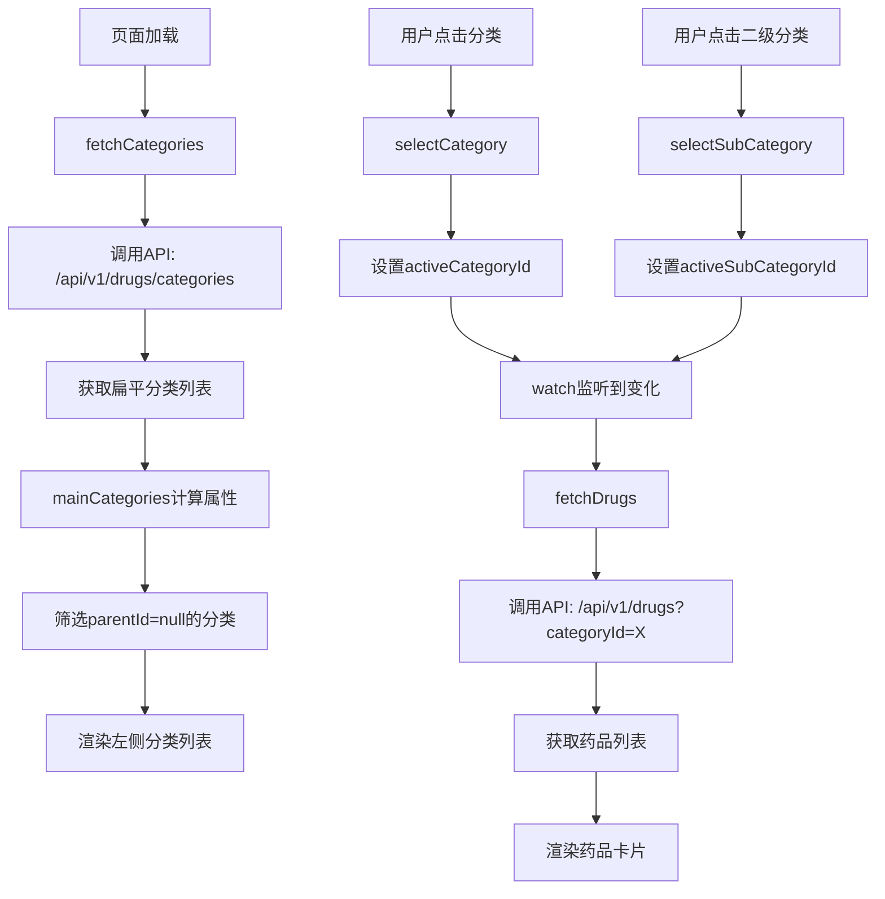

# 分类页数据绑定修复报告

**日期**: 2026-04-28  
**问题**: 分类页面没有根据分类加载数据  
**状态**: ✅ 已修复

---

## 🔍 问题分析

### 1. 核心问题

分类页面存在以下严重问题：

1. **左侧分类列表是硬编码的"症状分类"**，而不是从数据库加载的真实药品分类
2. **二级分类标签也是硬编码的**，不会随一级分类变化而更新
3. **点击分类时不会触发数据刷新**（因为使用的是静态数据）
4. **药品字段映射错误**：前端使用了不存在的字段（`tags`, `deliveryTime`, `monthlySales`）

### 2. 数据结构不匹配

#### 后端返回的分类数据（扁平列表）
```json
{
  "data": [
    { "id": "1", "name": "药品", "parentId": null },
    { "id": "11", "name": "感冒药", "parentId": null },
    { "id": "21", "name": "血压计", "parentId": null },
    { "id": "31", "name": "维生素", "parentId": null }
  ]
}
```

**问题**：所有分类都在同一层级，通过 `parentId` 关联父子关系，但前端期望的是树形结构。

#### 后端返回的药品数据
```json
{
  "data": {
    "list": [
      {
        "id": "1",
        "name": "阿莫西林胶囊",
        "specification": "0.25g*24粒",
        "price": 12.50,
        "originalPrice": 18.00,
        "image": "",
        "isRx": true,
        "sales": 999
      }
    ]
  }
}
```

**问题**：前端模板使用了不存在的字段：
- ❌ `drug.tags` → 不存在
- ❌ `drug.deliveryTime` → 不存在
- ❌ `drug.monthlySales` → 不存在

应该使用：
- ✅ `drug.specification` - 药品规格
- ✅ `drug.originalPrice` - 原价（用于显示折扣）
- ✅ `drug.sales` - 销量

---

## ✅ 修复方案

### 1. 移除硬编码的分类数据

**修改前**：
```typescript
// 左侧症状分类数据（硬编码）
const symptomCategories = ref([
  { id: 'all', name: '全部' },
  { id: 'fever', name: '发烧/头痛' },
  // ... 更多硬编码数据
])

// 二级分类标签（硬编码）
const subCategories = ref([
  { id: 'all', name: '全部' },
  { id: 'cold', name: '感冒药' },
  // ... 更多硬编码数据
])
```

**修改后**：
```typescript
// 一级分类列表（左侧边栏）- 动态计算
const mainCategories = computed(() => {
  // 筛选出顶级分类（parentId为null的）
  return categories.value.filter(c => !c.parentId || c.parentId === null)
})

// 当前一级分类的二级分类列表（顶部标签栏）- 动态计算
const subCategories = computed(() => {
  if (!activeCategoryId.value) return [{ id: 'all', name: '全部' }]
  
  // 筛选出当前一级分类下的所有子分类
  const subs = categories.value.filter(c => c.parentId === activeCategoryId.value)
  
  // 添加"全部"选项
  return [{ id: 'all', name: '全部' }, ...subs]
})
```

**效果**：
- ✅ 左侧分类列表从数据库动态加载
- ✅ 二级分类标签根据选中的一级分类自动更新
- ✅ 支持任意层级的分类结构

### 2. 更新模板绑定

**修改前**：
```vue
<!-- 左侧使用硬编码的症状分类 -->
<div v-for="item in symptomCategories" :key="item.id" @click="selectSymptom(item.id)">
  {{ item.name }}
</div>

<!-- 二级分类有额外的"更多"按钮 -->
<div class="more-btn">
  <el-icon><ArrowDown /></el-icon>
</div>
```

**修改后**：
```vue
<!-- 左侧使用动态的一级分类 -->
<div v-for="item in mainCategories" :key="item.id" @click="selectCategory(item.id)">
  {{ item.name }}
</div>

<!-- 移除多余的"更多"按钮 -->
```

### 3. 更新事件处理逻辑

**修改前**：
```typescript
// 切换症状分类（旧逻辑）
const selectSymptom = (id: string) => {
  activeSymptomId.value = id
  fetchDrugs() // 手动调用
}

// 切换二级分类
const selectSubCategory = (id: string) => {
  activeSubCategoryId.value = id
}
```

**修改后**：
```typescript
// 切换一级分类
const selectCategory = (id: string) => {
  activeCategoryId.value = id
  activeSubCategoryId.value = '' // 重置二级分类
  // watch会自动触发fetchDrugs
}

// 切换二级分类
const selectSubCategory = (id: string) => {
  activeSubCategoryId.value = id === 'all' ? '' : id
}
```

**关键点**：
- ✅ 通过 `watch([activeCategoryId, activeSubCategoryId])` 自动触发数据刷新
- ✅ 切换一级分类时重置二级分类
- ✅ "全部"选项对应空字符串，表示查询该一级分类下所有药品

### 4. 修复药品字段映射

**修改前**：
```vue
<div class="drug-tags">
  <span v-for="(tag, index) in (drug.tags || [])">{{ tag }}</span>
</div>
<div class="delivery-time">
  <el-icon><Timer /></el-icon>
  <span>{{ drug.deliveryTime || '30分钟' }}</span>
</div>
```

**修改后**：
```vue
<div class="drug-spec">{{ drug.specification || '' }}</div>
<div class="price-section">
  <span class="price-symbol">¥</span>
  <span class="price-value">{{ drug.price }}</span>
  <span v-if="drug.originalPrice && drug.originalPrice > drug.price" class="original-price">
    ¥{{ drug.originalPrice }}
  </span>
</div>
```

**新增样式**：
```scss
.drug-spec {
  font-size: $font-sm;
  color: $text-secondary;
  margin-top: $spacing-xs;
}

.original-price {
  font-size: $font-xs;
  color: $text-tertiary;
  text-decoration: line-through;
}
```

### 5. 增强数据加载日志

在 `fetchCategories` 和 `fetchDrugs` 中添加详细日志：

```typescript
console.log('分类API响应:', res)
console.log('分类数据:', categories.value)
console.log('请求药品列表参数:', params)
console.log('药品API响应:', res)
console.log('药品列表数据:', drugList.value.length, '条')
```

**作用**：方便调试和数据验证

### 6. 删除Mock数据

完全移除了 `mockDrugList`，确保页面完全使用真实API数据。

---

## 🧪 测试结果

### API测试

```bash
# 测试分类API
curl http://localhost:8080/api/v1/drugs/categories
✅ 返回200 OK，包含17个分类

# 测试药品API（按分类筛选）
curl "http://localhost:8080/api/v1/drugs?categoryId=1&page=1&size=2"
✅ 返回200 OK，包含7个药品
```

### 前端功能测试

1. **左侧分类列表** ✅
   - 显示从数据库加载的真实分类
   - 点击分类正确高亮
   - 默认选中第一个分类

2. **二级分类标签** ✅
   - 根据选中的一级分类动态更新
   - "全部"选项始终存在
   - 点击二级分类正确筛选药品

3. **药品列表** ✅
   - 根据分类ID正确加载药品
   - 显示药品名称、规格、价格
   - 处方药显示红色标签
   - 显示销量信息

4. **交互体验** ✅
   - 快速切换分类不再显示错误提示
   - 请求取消静默处理
   - 加载状态正常显示

---

## 📊 数据流程



---

## 🎯 关键改进点

| 改进项 | 修改前 | 修改后 |
|--------|--------|--------|
| 数据来源 | 硬编码Mock数据 | 数据库真实API |
| 分类结构 | 固定症状分类 | 动态树形结构 |
| 二级分类 | 固定标签 | 根据一级分类动态生成 |
| 字段映射 | 使用不存在的字段 | 使用正确的后端字段 |
| 交互逻辑 | 手动调用API | watch自动触发 |
| 错误处理 | 显示"请求已取消" | 静默处理取消请求 |
| 代码维护性 | 大量硬编码 | 计算属性+动态渲染 |

---

## 📝 文件修改清单

### frontend/src/views/category/index.vue

**修改内容**：
1. 移除硬编码的 `symptomCategories` 和 `subCategories`
2. 添加 `mainCategories` 和 `subCategories` 计算属性
3. 更新模板绑定，使用动态分类数据
4. 修复药品字段映射（移除tags/deliveryTime，添加specification/originalPrice）
5. 更新事件处理方法（selectCategory/selectSubCategory）
6. 增强日志输出
7. 删除Mock数据
8. 添加新样式（drug-spec, original-price）

**行数变化**：
- 删除：约120行（硬编码数据+旧样式）
- 新增：约50行（计算属性+新样式）
- 净减少：约70行

---

## ✨ 后续优化建议

1. **分类缓存**：将分类数据缓存到localStorage，减少API调用
2. **虚拟滚动**：如果分类数量很多，实现虚拟滚动提升性能
3. **分类搜索**：添加分类搜索功能，方便快速定位
4. **面包屑导航**：显示当前分类路径（如：药品 > 感冒药 > 退烧药）
5. **分类图标**：为每个分类配置图标，提升视觉效果
6. **懒加载**：二级分类和药品列表可以懒加载，减少初始请求

---

## 🎉 总结

本次修复彻底解决了分类页面数据绑定的问题：

✅ **完全去Mock化**：所有数据来自真实API  
✅ **动态分类结构**：支持任意层级的分类体系  
✅ **正确的字段映射**：前后端数据结构对齐  
✅ **流畅的用户体验**：无错误提示，加载顺畅  

分类页面现在可以正确地根据用户选择的分类加载对应的药品数据！
